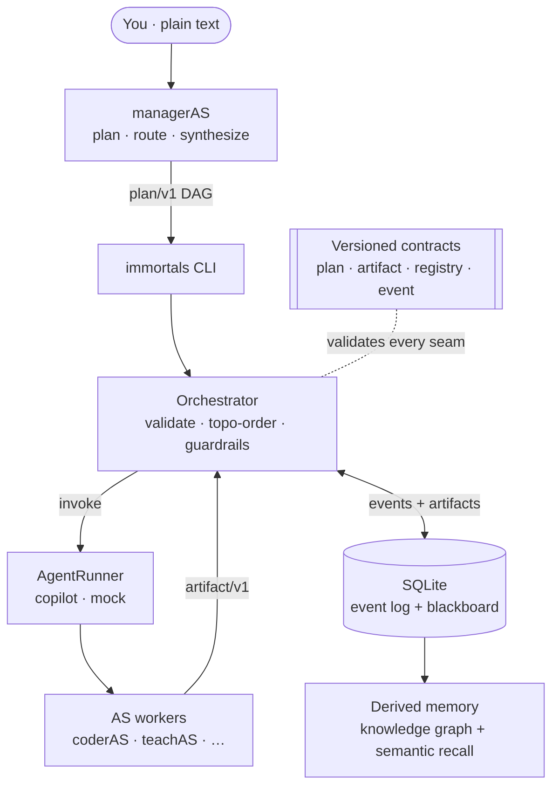

# Immortals

> **You bring the goal in plain English; a manager agent brings the expert team, the
> coordination, the quality control, and the memory — and gives you back a finished result.**

[](LICENSE)
[](pyproject.toml)
[](tests/)
[](CHANGELOG.md)

A manager-orchestrated multi-agent system over the **AS agent suite** (coderAS, experimentAS,
teachAS, prepAS, researchAS, paperAS, patentAS, presentAS, discussAS, …). *Immortals is the
orchestration system; the AS agents are "the immortals" it commands.*

- **managerAS** — the single user-facing agent. Turns a task (structured or vague) into a
  typed **plan** (a DAG of agent calls), routes each node to the right specialist, holds a
  quality bar, re-plans on failure, and synthesizes the result.
- **Orchestrator** (`immortals/`) — deterministic Python. Validates the plan, executes the
  DAG, validates every seam contract, runs guardrails, and mediates all inter-agent I/O.
- **Workers** — the existing `~/.copilot/agents/*.md` personas, invoked through a swappable
  `AgentRunner` (Backend A = headless `copilot` today; LangGraph/ACP later).
- **Memory** — local-first SQLite (append-only `event/v1` log + persisted artifacts + a shared
  `notes` KV; runs are reconstructable by folding the log), exposed over a zero-dep MCP server.

See `design/architecture.md` (target spec), `design/plan.md` (build order), and
`design/handoff.md` (state + decision log AS-001…AS-028).

## Architecture at a glance


## Quickstart
```pwsh
python -m venv .venv; .\.venv\Scripts\Activate.ps1
pip install -e ".[dev]"
pytest                                   # 159 tests, no external services

# run the bundled sample plan (teach → quiz) with the no-copilot mock backend
immortals run --plan-file scripts\sample_eigen_plan.json --backend mock --pretty
```
Day-to-day you just talk to **managerAS** (`copilot --agent managerAS`) and it writes and runs
the plan for you — see [Giving the suite a plain-text idea](#giving-the-suite-a-plain-text-idea-the-normal-way).
Every command is also available as `python -m immortals …`.

## What is this, in plain language?
Think of Immortals as **a small expert team that works for you**, with a single project
manager you talk to. You describe what you want in normal words — "help me turn this idea into a
research paper", "teach me how transformers work", "get me ready for my interview" — and the
manager figures out *who* on the team should do *what*, in *what order*, then hands you back the
finished result. You never have to micro-manage the specialists; you talk to one person, the
manager, and the team does the rest behind the scenes.

**The manager:**
- **managerAS** — the only one you talk to. It listens, asks a few clarifying questions, makes a
  plan, assigns the work to the right experts, checks their output for quality, and gives you the
  final answer. If something fails, it re-plans and tries again.

**The team of specialists** (managerAS picks whichever the job needs — you don't have to):

| Specialist | What it does for you |
|---|---|
| **researchAS** | Researches a topic or domain, finds prior work, checks if an idea is novel, does cited deep dives. |
| **experimentAS** | Designs and runs rigorous experiments to test whether an idea, product, or claim actually holds up. |
| **coderAS** | Writes, fixes, refactors, and runs real code to a professional standard. |
| **discussAS** | Pressure-tests your plans and decisions, brainstorms options, and gives blunt critical feedback. |
| **teachAS** | Explains complex topics from the ground up and quizzes you until it really clicks. |
| **prepAS** | Prepares you for high-stakes moments — interviews, exams, presentations, defenses. |
| **paperAS** | Helps you write, review, and position an academic paper. |
| **patentAS** | Drafts and reviews patents, searches prior art, and assesses patentability. |
| **presentAS** | Turns technical work into a clear, audience-ready slide deck. |

Everything the team produces is **saved and reviewable** — you can always go back and see exactly
which expert did what, and why (nothing is a black box).

## End-to-end example — from a rough idea to a finished result
Suppose you tell the manager:

> "I have an idea for a faster caching algorithm. I want to know if it's actually new, test
> whether it's faster, build a working version, and end up with slides I can present."

Here's what happens, step by step — **you only sent that one sentence:**

1. **managerAS understands the goal** and breaks it into a plan (a small flowchart of tasks). It
   may ask you one or two quick questions first (e.g. "what are you comparing against?").
2. **researchAS** checks whether the idea is genuinely novel and gathers the relevant prior work.
3. **experimentAS** designs a fair test (what to measure, what to compare against, how many runs)
   so the "is it faster?" answer is trustworthy and not fooling itself.
4. **coderAS** builds a working version of the algorithm and runs the experiment for real.
5. **discussAS** pokes holes in the results — did we measure the right thing? any hidden flaw? —
   so weak spots are caught early.
6. **presentAS** turns the verified findings into a clean slide deck you can actually show people.
7. **managerAS reviews everything, stitches it together, and hands you the final package** —
   the novelty check, the experiment results, the working code, and the slides.

Each step's output automatically feeds the next (the research informs the experiment; the code
runs the experiment; the verified results become the slides). The manager runs independent steps
**in parallel** where it can, enforces **budget/time limits** so nothing runs away, and pauses for
your **approval** before anything risky. If a step fails, the run can **resume** from where it
stopped instead of starting over.

**The big idea:** you bring the goal in plain English; the suite brings the expert team,
the coordination, the quality control, and the memory — and gives you back a finished result.

### Try it yourself — a real demo, start to finish
You don't need real agents to see the machinery work. The repo ships a sample plan that chains two
experts — **teach** a concept, then **quiz** on it — and a `mock` backend that runs it instantly
with no `copilot` calls. Below is an actual run (install first: see [Develop](#develop)).

**Step 1 — run the plan.** The orchestrator executes both steps in dependency order and saves
everything to a SQLite store:

```pwsh
python -m immortals run --plan-file scripts\sample_eigen_plan.json --backend mock --db runs\demo.db --pretty
```
```jsonc
{
  "task_id": "teach-quiz-eigenvectors",
  "status": "completed",
  "artifacts": {
    "eigenvectors-lesson": {            // produced by the first expert (teach)
      "produced_by": "teachAS",
      "type": "mock_result",
      "content": { "echo": "Teach the user what eigenvectors and eigenvalues are ..." },
      "status": "ok"
    },
    "eigenvectors-quiz": {              // second expert; consumed the lesson as input
      "produced_by": "teachAS",
      "content": { "echo": "Using the lesson, create and run a quiz ..." },
      "provenance": { "inputs": ["eigenvectors-lesson"] },
      "status": "ok"
    }
  },
  "event_count": 8                      // a full, replayable audit trail
}
```

**Step 2 — recall what was produced, semantically.** Ask in plain words; the derived memory ranks
the saved work by relevance:

```pwsh
python -m immortals recall --db runs\demo.db --query "explain eigenvalues" --pretty
```
```json
{
  "query": "explain eigenvalues",
  "hits": [
    { "kind": "artifact", "ref_id": "eigenvectors-lesson", "agent": "teachAS", "score": 0.282843 }
  ]
}
```

**Step 3 — see the knowledge graph** of who produced what and how the steps depend on each other:

```pwsh
python -m immortals recall --db runs\demo.db --graph --task-id teach-quiz-eigenvectors --pretty
```
```jsonc
{
  "nodes": [ "task:…", "agent:teachAS", "artifact:…/eigenvectors-lesson", "artifact:…/eigenvectors-quiz" ],
  "edges": [
    { "from": "task:…",  "to": "artifact:…/eigenvectors-lesson", "rel": "contains" },
    { "from": "artifact:…/eigenvectors-quiz", "to": "artifact:…/eigenvectors-lesson", "rel": "depends_on" },
    { "from": "artifact:…/eigenvectors-lesson", "to": "agent:teachAS", "rel": "produced_by" }
  ]
}
```

That's the whole loop — **plan → execute → persist → recall** — running locally end to end. Swap
`--backend mock` for the default `copilot` backend (and a multi-expert plan) and the *same*
commands run the real thing. In day-to-day use you just talk to **managerAS** and it writes the
plan and runs these commands for you.

## Giving the suite a plain-text idea (the normal way)
**You don't write JSON plans by hand.** The plain-language entry point is **managerAS** — a Copilot
agent. Start it from the project directory (so it can call the orchestrator) and just type your idea:

```pwsh
cd C:\Code\Immortals
copilot --agent managerAS
```
```text
> I have an idea for a faster caching algorithm. Check if it's novel, test whether
  it's actually faster, build a working version, and make slides I can present.
```

From that one sentence, managerAS does the rest on its own:
1. asks a couple of clarifying questions (e.g. "what are you comparing against?"),
2. writes a typed `plan/v1` (the DAG of expert tasks) and routes each step to the right specialist,
3. runs it via the orchestrator (`python -m immortals run --plan-file <plan> --backend copilot`),
4. quality-checks each worker's output, re-planning on failure, and
5. hands you back a synthesized, plain-language result.

That's the whole UX: **plain text in → finished result out.** Everything in [Getting started](#getting-started)
and the [Command reference](#command-reference) below is the *under-the-hood* layer managerAS drives
for you — useful to run by hand for testing, scripting, or CI, but not required for normal use.

> **Two entry points:**
> - **Plain-text idea** → `copilot --agent managerAS`, then type. managerAS generates and runs the plan.
> - **A ready-made JSON plan** (testing / scripting / CI) → `python -m immortals run --plan-file …` directly.
> The `immortals run` CLI takes a *JSON plan*, never free text — free text always goes through managerAS.

## Getting started
> The orchestrator CLI below is the layer **managerAS** drives for you (see
> [Giving the suite a plain-text idea](#giving-the-suite-a-plain-text-idea-the-normal-way)). Run it
> by hand for dry-runs, testing, scripting, or CI.

**Prereqs:** Python 3, the `copilot` CLI on PATH, and the `AS` worker personas in
`~/.copilot/agents/` (for the `copilot` backend — including `managerAS` itself). Install the
package first (see [Develop](#develop)).

A **plan** is a `plan/v1` JSON document: a `task_id`, a `goal`, and a DAG of `nodes` (each names
an `agent`, a `prompt`, what it `produces`, and its `inputs`/`depends_on`). A ready-to-run sample
lives at `scripts/sample_eigen_plan.json` (teach eigenvectors → quiz on them).

```pwsh
# 0. See the agent catalogue and route a free-text need to a specialist
python -m immortals agents --pretty
python -m immortals route --need "teach me a concept and quiz me" --pretty

# 1. Dry-run the sample plan with the mock backend (no copilot calls) to learn the shape
python -m immortals run --plan-file scripts\sample_eigen_plan.json --backend mock --pretty

# 2. Run it for real, persisting the event log + artifacts to a SQLite store
python -m immortals run --plan-file scripts\sample_eigen_plan.json --db runs\eigen.db --pretty

# 3. Reconstruct / audit the run by folding its event log
python -m immortals replay --db runs\eigen.db --list
python -m immortals replay --db runs\eigen.db --task-id teach-quiz-eigenvectors --pretty

# 4. Semantic recall over what's been produced (derived memory), or dump the knowledge graph
python -m immortals recall --db runs\eigen.db --query "explain eigenvalues" --pretty
python -m immortals recall --db runs\eigen.db --graph --pretty
```

Handy flags: `--max-workers` (parallelism), `--resume`, `--from`/`--to` (partial re-runs),
`--max-tokens`/`--max-seconds` (guardrails), `--approve` (human-in-the-loop). `run` prints a JSON
result and exits non-zero if the run didn't complete, so it composes in scripts. See the full
[Command reference](#command-reference) below.

## Command reference
Every command is `python -m immortals <command> …` and prints JSON to stdout. `--pretty` (indent)
and `--events` (include the full event trail, where applicable) are available on most commands.

### `run` — execute a plan through the orchestrator
Validates a `plan/v1`, executes its DAG, and prints the result (`status`, `artifacts`, `event_count`).

| Flag | Description |
|---|---|
| `--plan-file PATH` | Read the plan from a JSON file. |
| `--plan JSON` | Inline plan JSON string (mutually exclusive with `--plan-file`; else reads stdin). |
| `--backend {copilot,mock}` | Invocation backend. `copilot` (default) runs real headless workers; `mock` echoes prompts for dry-runs/tests. |
| `--workspace DIR` | Directory workers may access (passed as `--add-dir`); least-privilege by default. |
| `--db PATH` | Persist the event log + artifacts to this SQLite store (enables replay/resume/recall). |
| `--share-memory` | Inject the memory MCP server (bound to `--db`) into workers so they share memory. Requires `--db`. |
| `--max-workers N` | Run independent DAG nodes concurrently, up to `N` (default `1` = sequential). |
| `--resume` | Skip nodes already completed in `--db` (resume an interrupted run). Requires `--db`. |
| `--from NODE` | Partial re-run: execute `NODE` and everything downstream; source upstream from `--db`. |
| `--to NODE` | Partial re-run: execute only `NODE` and its upstream dependencies. |
| `--max-tokens N` | Guardrail: cap cumulative tokens across the run. |
| `--max-seconds S` | Guardrail: wall-clock budget for the whole run. |
| `--max-nodes N` | Guardrail: cap the number of node executions. |
| `--max-agent-calls N` | Guardrail: cap invocations of any single agent (loop guard). |
| `--approve` | Auto-approve approval-required nodes (automation mode). |
| `--enforce-approvals` | Apply each agent manifest's `approval_default` as a sign-off floor. |
| `--events` | Include the full event trail in the output (default: just a count). |
| `--pretty` | Pretty-print the JSON output. |
| `--quiet` | Suppress the live per-agent progress stream. |

By default, `run` streams a **live per-agent progress + reflection** to **stderr** as the DAG
executes (each node start, each agent's output with a one-line summary of what it produced, input
deps, and failures/approvals) — so a long run isn't a silent black box. It's ASCII-only (renders on
any console) and goes to **stderr**, so the machine-readable JSON result on **stdout** is unchanged
and still composes in scripts. Use `--quiet` to turn the stream off.

### `replay` — reconstruct a past run from its event log
| Flag | Description |
|---|---|
| `--db PATH` | **Required.** The SQLite store written by `run --db`. |
| `--task-id ID` | Reconstruct this task by folding its event log. |
| `--list` | List all task ids in the store instead. |
| `--events` / `--pretty` | Include the full event trail / pretty-print. |

### `recall` — semantic search & graph navigation over derived memory
| Flag | Description |
|---|---|
| `--db PATH` | **Required.** The SQLite store written by `run --db`. |
| `--query TEXT` | Free-text query; ranks prior artifacts + facts by relevance. |
| `--graph` | Dump the knowledge graph (nodes + edges) instead of searching. |
| `--task-id ID` | Scope retrieval/graph to one task. |
| `--agent NAME` | Scope retrieval to one agent's namespace. |
| `--top N` | Return at most `N` hits (default `5`). |
| `--pretty` | Pretty-print the JSON output. |

### `agents` — list the agent catalogue
Prints every registered worker manifest (capabilities, `when_to_use`, cost hint, approval default)
— the table the manager routes against. Flag: `--pretty`.

### `route` — rank agents against a need
| Flag | Description |
|---|---|
| `--need TEXT` | **Required.** Free-text need / capability to match against manifests. |
| `--top N` | Return at most `N` candidates. |
| `--pretty` | Pretty-print the JSON output. |

### `memory` — manage persistent MCP-server registration
`python -m immortals memory {register,unregister,status}` adds/removes/inspects the memory MCP
server in `~/.copilot/mcp-config.json` (for the default agent / interactive sessions). Flag:
`--config-path PATH` to override the config location. See [Shared worker memory](#shared-worker-memory-mcp).

### `dashboard` — read-only web inspector (prototype frontend)
`immortals dashboard --db <run.db>` serves a localhost web UI with four read-only views over a run
store: a **runs list**, a **run detail** (DAG + event timeline + per-node cost), an **artifact
viewer**, and **semantic recall** + knowledge graph. Needs the optional extra
(`pip install -e ".[dashboard]"`); FastAPI/uvicorn stay out of the lean core. Flags: `--host`
(default `127.0.0.1`), `--port` (default `8765`). It's the read-half seed of the future
manager-as-a-service API — see `design/prototype-frontend-handoff.md`.

## Contracts (the architecture)
Versioned JSON, validated at every seam — in `immortals/contracts/schemas/`:
`plan/v1`, `artifact/v1`, `registry/v1`, `event/v1`.

## Develop
```pwsh
python -m venv .venv; .\.venv\Scripts\Activate.ps1
pip install -e ".[dev]"
pytest
```

## Shared worker memory (MCP)
The event-sourced store is exposed as a zero-dependency MCP server
(`immortals/memory/mcp_server.py`) offering reads over the blackboard and event log
(`memory_{get_artifact,list_artifacts,recent_events}`), a shared `notes` KV
(`memory_{put_note,get_note,list_notes}`), agent-namespaced facts
(`memory_{add_fact,list_facts}`), and derived-memory queries (`memory_search`, `memory_graph`).
`run --db <path> --share-memory` injects it (bound to the run's store) and sets
`IMMORTALS_MEMORY_DB` for the worker. Register it persistently for the default agent / interactive
sessions with `immortals memory register` (reversible via `immortals memory unregister`).

**Known CLI limitation (R7, AS-022):** in headless `-p` mode the copilot CLI exposes MCP tools to
the *default* agent but **not to custom `--agent` workers** — verified for both `--additional-mcp-config`
and persistent registration (the server connects, but its tools aren't in a custom agent's toolset).
Because Immortals workers are always custom agents, **worker-initiated** shared memory is currently
blocked by the CLI. Today the orchestrator remains the central writer (every worker artifact + event
is persisted to the shared store, so cross-run memory and audit are intact); worker-shared
read/write will be delivered by the orchestrator acting as the **memory broker** (inject relevant
memory into prompts; persist worker-declared notes) rather than via worker-side MCP calls.
